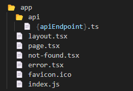

# Next.js React Web Project - WaiZap

Este é um projeto React baseado em [Next.js](https://nextjs.org/) criado com [`create-next-app`](https://github.com/vercel/next.js/tree/canary/packages/create-next-app). A configuração padrão foi ajustada para incluir:

- [Prettier](https://prettier.io/): Formatador de código opinativo.
- [Sass](https://sass-lang.com/guide): Extensão popular do CSS.
- [Tailwind CSS](https://tailwindcss.com/): Framework CSS utilitário.
  - [tailwind-merge](https://www.npmjs.com/package/tailwind-merge): Função utilitária para combinar classes Tailwind sem conflitos de estilo.
  - [prettier-plugin-tailwindcss](https://www.npmjs.com/package/prettier-plugin-tailwindcss): Plugin do Prettier que organiza automaticamente as classes do Tailwind na ordem recomendada.
- [Storybook](https://storybook.js.org/): Ferramenta para testar e visualizar componentes de UI em isolamento.
- [SVGR](https://react-svgr.com/): Ferramenta para usar SVGs diretamente como componentes React.
- Geração automática de [Sitemap](https://developers.google.com/search/docs/advanced/sitemaps/overview) com [next-sitemap](https://www.npmjs.com/package/next-sitemap).
- Linting de commits com [Conventional Commits](https://www.conventionalcommits.org/en/v1.0.0/#summary).

## Como Começar

Use o [Create Next App](https://nextjs.org/docs/api-reference/create-next-app) para iniciar o projeto:

```bash
yarn create next-app -e https://github.com/ouedyan/nextjs-template
```

Verifique todas as seções TODO no projeto para completar a configuração.

## Scripts

- **Desenvolvimento**: Execute o servidor de desenvolvimento.

  ```bash
  yarn dev
  ```

- **Build de Produção**: Compile o projeto para produção.

  ```bash
  yarn build
  ```

- **Execução em Produção**: Rode o projeto em modo de produção.

  ```bash
  yarn start
  ```

- **Storybook**: Inicie o servidor do Storybook.

  ```bash
  yarn storybook
  ```

- **Build do Storybook**: Construa o Storybook como uma aplicação web estática.

  ```bash
  yarn build-storybook
  ```

## Estrutura de Pastas do Projeto

Abaixo está uma visão geral da estrutura de pastas do projeto atualizada:

```
📂 app
  📂 api
    📄 {apiEndpoint}.ts
  📄 layout.tsx
  📄 page.tsx
  📄 not-found.tsx
  📄 error.tsx
  📄 favicon.ico
  📄 index.js

📂 components
  📂 common
  📂 hooks
  📂 layout
  📄 {Component}.tsx

📂 lib
  📂 data
    📄 atomStore.ts
  📂 utils
    📄 {utilityFunction}.ts

📂 pages
  📂 api
  📄 _app.js

📂 public
  📂 favicons
  📂 icons
  📂 images

📂 styles
  📄 globals.scss

📂 i18n
  📂 locales
    📄 {locale}.json

📂 stories
  📂 examples
    📄 {Component}.stories.tsx

📄 tsconfig.json
📄 next.config.js
📄 tailwind.config.js
```

### Principais Tecnologias Utilizadas:

1. **React**:

   - [W3Schools React tutorial](https://www.w3schools.com/react)
   - [React Docs](https://reactjs.org/docs)

2. **Next.js**:

   - [Aprenda Next.js](https://nextjs.org/learn)
   - [Documentação do Next.js](https://nextjs.org/docs)

3. **Tailwind CSS**:

   - [Documentação Tailwind](https://tailwindcss.com/docs)
   - [Guia de Instalação do Tailwind com Next.js](https://tailwindcss.com/docs/guides/nextjs)

4. **TypeScript**:
   - [W3Schools TypeScript tutorial](https://www.w3schools.com/typescript/)

## Proximos passos

- Para desenvolvimento da tela de home, o codigo será incluido no index.js na pasta **app**


